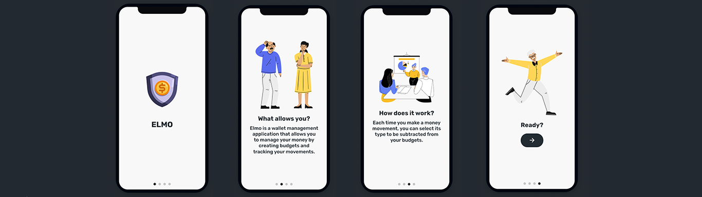
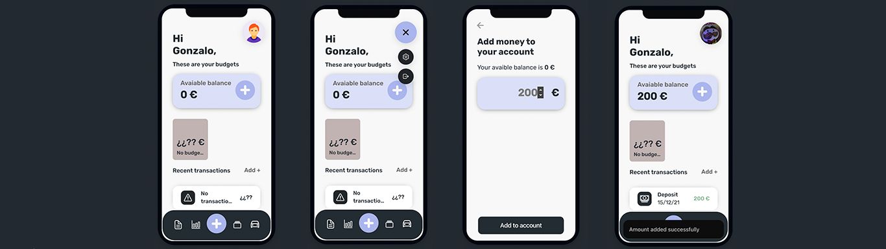
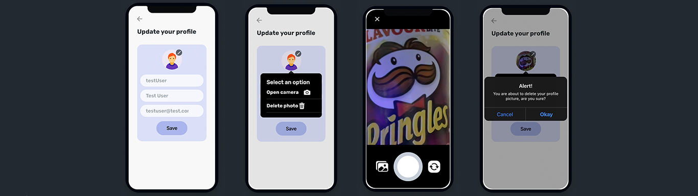
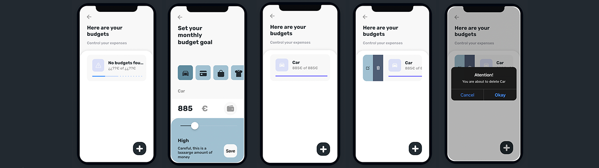
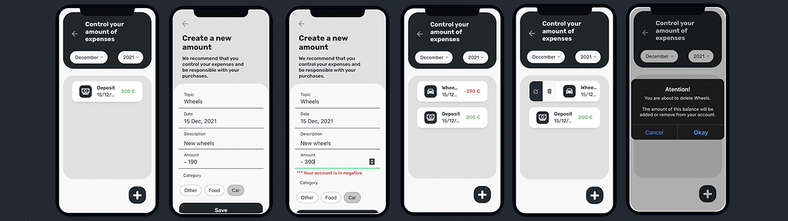

  
  <h3 align="center" margin-top="-40">ELMO</h3>

 

## 👀 Qué es Elmo?
Elmo es una aplicación de gestión de cartera que te permite administrar tu dinero creando objetivos de gasto y haciendo un seguimiento de tus movimientos.   Además incluye una herramienta la cual te permitirá calcular el coste de los trayectos que hagas en tu vehículo y un apartado donde podrás crear notas para poder gestionar mejor tu día a día.
###### (Este ultimo apartado está en desarrollo) <a href="https://youtu.be/W98SmA-GSCA">Ver video</a>

------

## 📱 Plataformas 
Elmo está desarrollada para que pueda ser utilizada tanto en Android como en iOS

Podrás probar la aplicación a través del siguiente link de [descarga](http:/https://github.com/gonzalosalmeron/elmoApp/blob/master/android/app/release/elmo.apk/ "descarga")

Para iniciar sesión deberás de iniciar sesión con el siguiente usuario  
`usuario -> gonzxlosalmeron@gmail.com`  
`contraseña -> 123456`

------
## 🤖 Tecnologías usadas

 

 
------

## 🎮 Funcionamiento y maquetación
···· Leer de izquierda a derecha ····

### Diapositivas
- La primera pantalla que aparece es una pequeña introducción a la app

### Pantalla de bienvenida, login y register

### Home
- Home, donde podemos visualizar el dinero en nuestra cuenta, los presupuestos y los ultimos movimientos en nuestra cuenta.
- Menu desplegable donde podemos ver nuestra foto de perfil y si presionamos se desplegará enseñando dos botones más:
- - Configuración
- - Logout
- En esta pantalla podremos agregar dinero a nuestra cuenta
- Como se puede ver, el dinero ha sido añadido a nuestra cuenta, generándose a su vez un movimiento

### Configuración
- Se visualizan los datos del usuario
- El popOver ha sido desplegado, mostrando dos opciones, abrir la cámara y eliminar foto
- La opción de abrir la cámara ha sido seleccionada y la cámara se abre
- La opción de cerrar la cámara ha sido seleccionada (pero no ha sido aceptada)

### Presupuestos
- Se visualizan todos los presuestos (no hay ninguno creado)
- Se ha desplegado la pantalla para crear un presupuesto
- El presupuesto ha sido creado y se muestra por pantalla
- Si se hace un deslizamiento horizontal sobre el presupuesto, aparecen dos opciones -> editar y eliminar
- La opción de eliminar el presupuesto ha sido seleccionada

### Transacciones
- Podemos hacer un filtrado de las transacciones por mes y año
- Se ha desplegado la pantalla para crear una transacción
- Se muestra un aviso si la cantidad introducida en superior a la cantidad de dinero que se dispone en la cuenta
- El gasto ha sido creado y se muestra por pantalla
- Se muestran dos opciones si deslizamos la transacción -> editar y eliminar
- La opción de eliminar la transacción ha sido seleccionada

